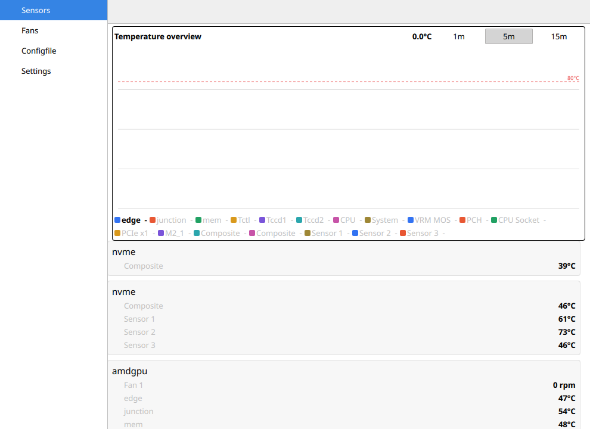
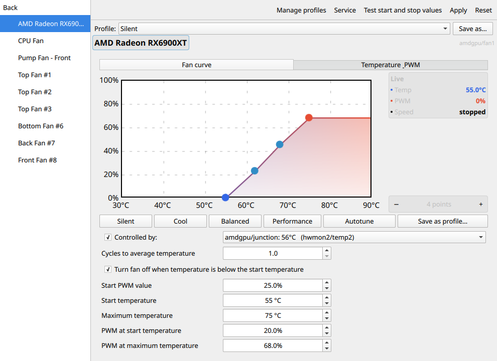
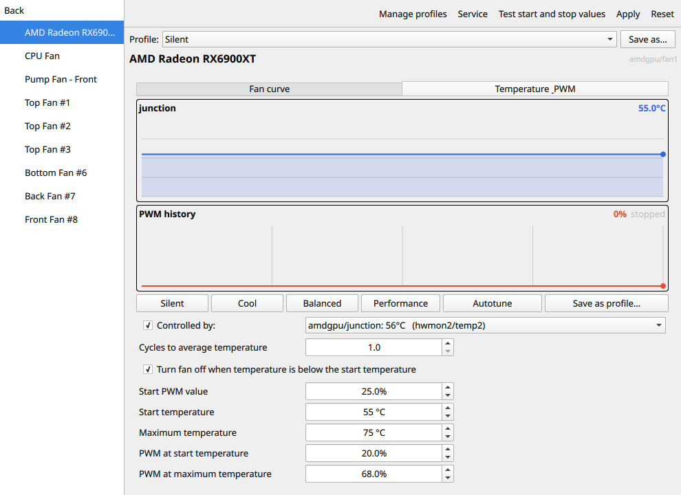
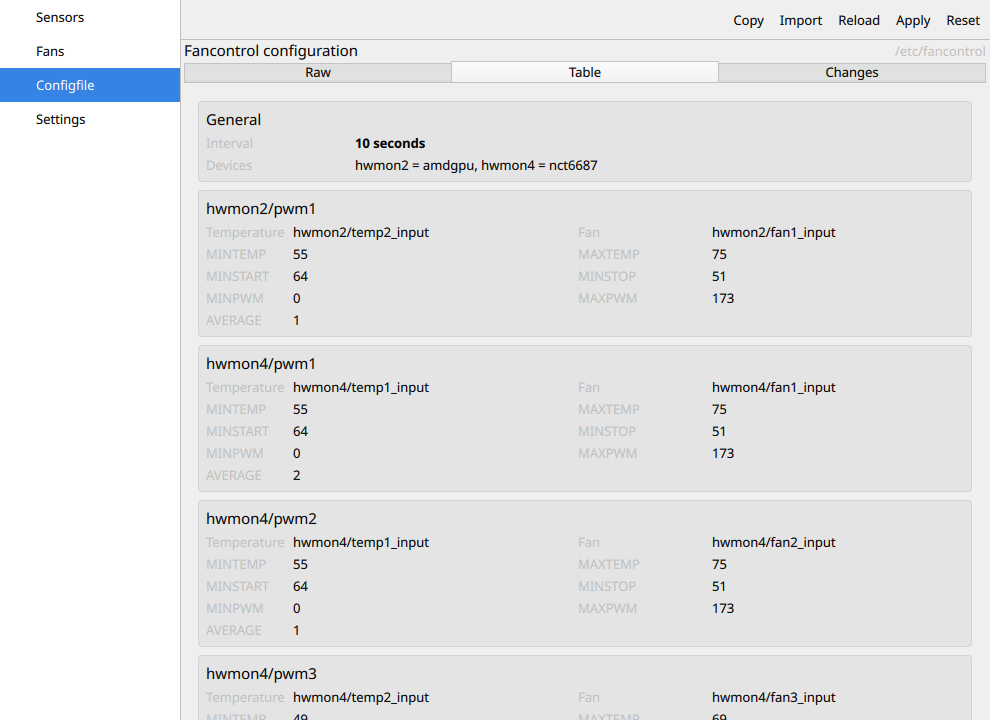
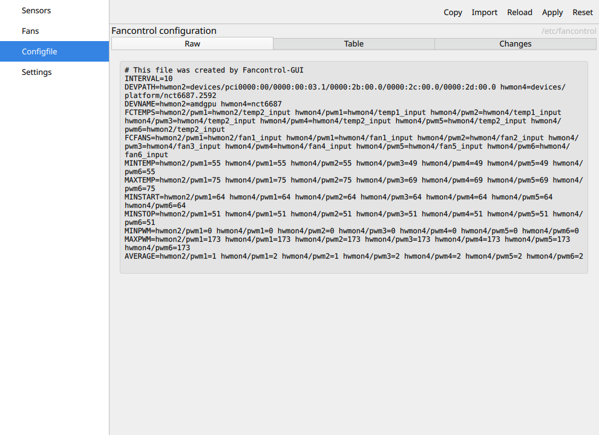
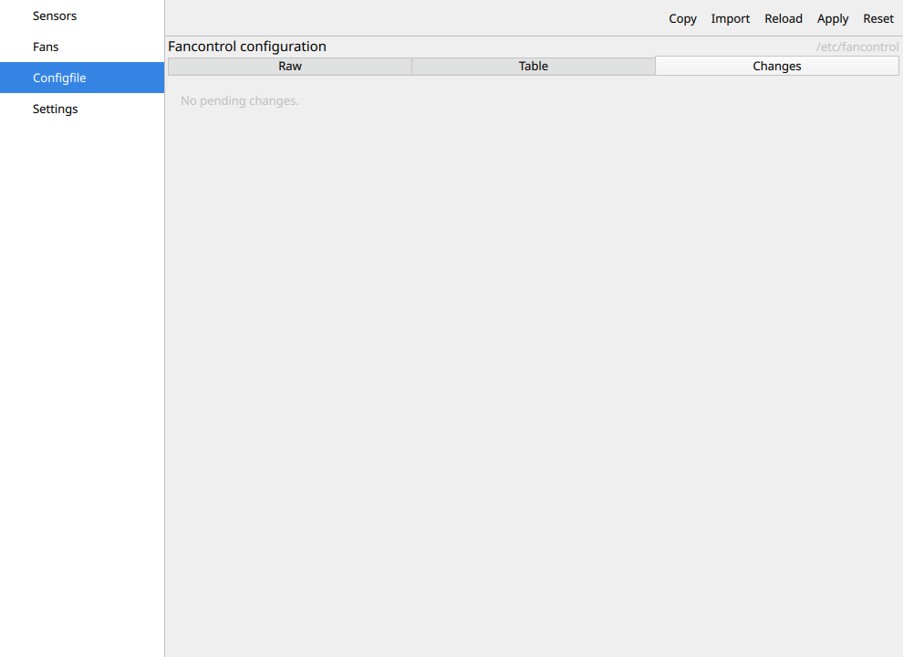
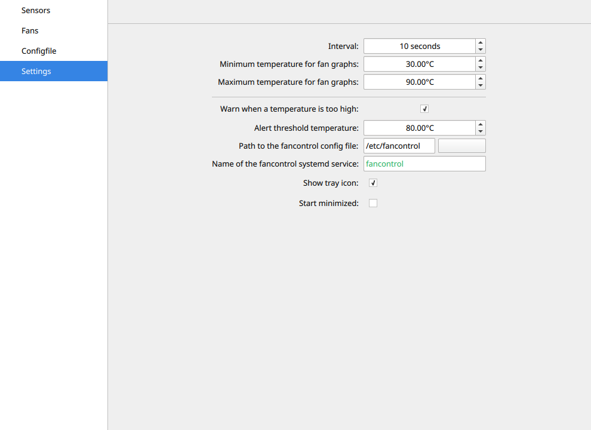

# fancontrol-gui

A GUI for [fancontrol](https://github.com/lm-sensors/lm-sensors), the fan-control
daemon shipped with lm-sensors. It lets you read and adjust fan speeds and watch
temperatures from a simple desktop application.

This is the **Qt 6 / KDE Frameworks 6** port (see [Status](#status)).

The app talks to the fancontrol daemon in two ways:

* It generates a fancontrol configuration file from your hardware and writes it
  through the KDE **KAuth** framework.
* It controls the `fancontrol` **systemd service** (start/stop/restart,
  apply-and-restart) through D-Bus via `systemd-communicator`.

The Qt6 build uses a dedicated systemd communicator based on systemd's D-Bus
API, so it works on modern distributions without relying on `pkexec` or the
ability to run the helper with root privileges.

## Features

* **Sensor overview** — live temperature chart and per-sensor values on the
  Sensors tab.
* **Fan control curves** — build PWM fan curves point by point. Drag the start
  and maximum anchors and the intermediate waypoints, add or remove points, and
  start from the **Silent**, **Cool**, **Balanced** or **Performance** presets.
* **Autotune** — measure the fan's real start and stop values. The test streams
  live phase feedback (finding the lowest speed, start speed, stop speed) with
  an abort button, and only applies what you confirm.
* **Editable fan names** — rename any fan inline; names are persisted and used
  everywhere in the UI.
* **Temperature & PWM history** — a live timeline plus the PWM duty cycle for
  the selected fan.
* **Profiles** — apply, create, save to, rename, duplicate and delete named
  profiles, with confirmation for destructive actions. Profiles can be imported
  from and exported to `*.conf` files.
* **Configuration file view** — the Configfile tab shows the generated file as
  **Raw** text, a structured **Table** (per-fan thresholds and PWM levels), and
  a **Changes** diff of pending edits. It validates the configuration and flags
  invalid combinations (e.g. `MINTEMP ≥ MAXTEMP`, `MINSTOP > MAXPWM`). A
  configuration can be imported from a URL or pasted directly, then reviewed
  before it is applied.
* **Temperature alarm** — enable a threshold; the app shows an inline alarm
  banner and raises a desktop notification (`KNotification`) when a sensor
  exceeds it, listing the offending sensor and current value.
* **Follows the system theme** — light and dark mode track the desktop setting
  live, without restarting the app.
* **Tray integration** — tray icon, start minimized, all optional.
* **Plasmoid & KCM** — optional KDE Plasma widget and system-settings module.

## Screenshots

Screenshots adapt to GitHub's light/dark theme.

### Sensors

<picture>
  <source media="(prefers-color-scheme: dark)" srcset="docs/screenshots/sensors-dark.png">
  
</picture>

### Fans — fan curve

<picture>
  <source media="(prefers-color-scheme: dark)" srcset="docs/screenshots/fans-curve-dark.png">
  
</picture>

### Fans — temperature & PWM

<picture>
  <source media="(prefers-color-scheme: dark)" srcset="docs/screenshots/fans-temperature-pwm-dark.png">
  
</picture>

### Configfile — table

<picture>
  <source media="(prefers-color-scheme: dark)" srcset="docs/screenshots/configfile-table-dark.png">
  
</picture>

### Configfile — raw and changes

<picture>
  <source media="(prefers-color-scheme: dark)" srcset="docs/screenshots/configfile-raw-dark.png">
  
</picture>

<picture>
  <source media="(prefers-color-scheme: dark)" srcset="docs/screenshots/configfile-changes-dark.png">
  
</picture>

### Settings

<picture>
  <source media="(prefers-color-scheme: dark)" srcset="docs/screenshots/settings-dark.png">
  
</picture>

## Status

* **2026** — ported from Qt5/KF5 to **Qt6 / KDE Frameworks 6**. Build, install
  and the bundled unit tests are verified against current KF6 on up-to-date
  distributions; continuous integration builds and runs the test suite on every
  push.
* Recent UX work includes the tabbed Fans layout, the structured Configfile
  view with validation and diffing, full profile management, an autotune rework,
  editable fan names, live system dark/light following, and a themed
  application icon.

## Tested on

The current Qt6/KF6 build is developed and verified on:

* **OS:** Debian GNU/Linux 13 (trixie), kernel 6.18
* **Toolkit:** Qt 6.8.2 and KDE Frameworks 6.13
* **Desktop:** GNOME (X11 and Wayland) — light/dark following was verified with
  both the GTK `color-scheme` setting and the Plasma colour scheme
* **Hardware:** AMD Radeon RX 6900 XT fan (`amdgpu`) and a Nuvoton NCT6687D
  controller (`nct6687`)

Distribution packaging known to work is listed under
[Build requirements](#build-requirements). Continuous integration builds the
project and runs the unit tests on every push.

## Build requirements

* Qt6: Base/Core, Widgets, Gui, QML, Quick, QuickControls2
* KF6: I18n, Auth, Config, Package, Declarative, CoreAddons, DBusAddons,
  Extra-Cmake-Modules, Notifications
* Other: a C++ compiler, Gettext, CMake

### Additional runtime requirements

* Qt6: Quick 2.15, QuickControls2 2.15, QuickLayouts 2.15, QuickDialogs
* KF6: Kirigami2 2.14

### Additional requirements for KCM

* KF6: KCMUtils

### Additional requirements for plasmoid

* KF6: Plasma

### Debian/Ubuntu

```
sudo apt-get install ca-certificates git build-essential cmake gcc g++ \
  libkf6config-dev libkf6auth-dev libkf6package-dev libkf6declarative-dev \
  libkf6coreaddons-dev libkf6dbusaddons-dev libkf6kcmutils-dev libkf6i18n-dev \
  libkf6plasma-dev libqt6core6 libqt6widgets6 libqt6gui6 libqt6qml6 \
  extra-cmake-modules qt6-base-dev libkf6notifications-dev \
  qml6-module-org-kde-kirigami qml6-module-qtquick-dialogs \
  qml6-module-qtquick-controls qml6-module-qtquick-layouts \
  qml6-module-qt-labs-settings qml6-module-qt-labs-folderlistmodel \
  cmake build-essential gettext
```

**Note:** tested on Ubuntu 24.04 LTS and Debian 12.

### Fedora

```
sudo dnf install git gcc g++ cmake kf6-ki18n-devel kf6-kauth-devel \
  kf6-kconfig-devel kf6-kpackage-devel kf6-kcoreaddons-devel \
  kf6-kdbusaddons-devel extra-cmake-modules kf6-knotifications-devel \
  qt6-qtquickcontrols2-devel kf6-kconfigwidgets-devel kf6-kcmutils-devel \
  kf6-plasma-devel cmake gettext qt6-qtbase-devel gcc-c++ \
  kf6-kdeclarative-devel qt6-qtquickcontrols qt6-qtquickcontrols2
```

**Note:** tested on Fedora 40.

## Install

```
git clone https://github.com/tmiland/fancontrol-gui.git
cd fancontrol-gui
mkdir build
cd build
cmake .. -DCMAKE_INSTALL_PREFIX=/usr -DBUILD_KCM=on -DBUILD_PLASMOID=on
make -j
sudo make install
```

If you run the application from the build tree instead of installing it, point
the QML engine at the module and package in the build/install tree, or simply
install it — the app loads its QML from the installed module.

## Build options

| Option | Default | Description |
| --- | --- | --- |
| `-DNO_SYSTEMD=true` | off | Build without systemd support. |
| `-DBUILD_KCM=on` | off | Also build the KDE Settings module. Only available when systemd support is enabled. |
| `-DBUILD_PLASMOID=on` | off | Also build the KDE Plasma plasmoid. |
| `-DINSTALL_POLKIT=true` | off | Install a polkit rules file that lets members of a group edit the config and manage the service without prompting. |
| `-DPOLKIT_GROUP_NAME=...` | `fancontrol` | Group allowed by the polkit rules file. |
| `-DSTANDARD_SERVICE_NAME=...` | standard | Name of the fancontrol service. |
| `-DSTANDARD_CONFIG_FILE=...` | standard | Path of the fancontrol config file. |
| `-DKDE_INSTALL_USE_QT_SYS_PATHS=true` | off | Use `/usr/lib/qt/qml` when your distribution places QML there instead of `/usr/lib/qml`. |

**KAuth notes:** KAuth does not currently support install prefixes other than
the one KAuth itself was installed into. To use another prefix, run the
application as root (or as a user with the required privileges) to avoid the
KAuth helper. To avoid authorizing every use of the helper, build with
`-DINSTALL_POLKIT=true`; this installs a polkit rules file allowing members of
the group `fancontrol` to edit the config file and control the service. The
group can be changed with `-DPOLKIT_GROUP_NAME`.

## Theming

The application follows the desktop's light/dark preference automatically and
updates live when it changes. On Plasma the reported colour scheme is used; on
GTK-based desktops (e.g. GNOME) the `org.gnome.desktop.interface color-scheme`
setting is consulted. Set `FANCONTROL_COLOR_SCHEME=dark` or `light` to override
the detection.

## Running the tests

```
cd build
ctest --output-on-failure
```

The suite (`hwmon`, `fan`, `pwmfan`, `temp` and config-loader tests) is built
when `BUILD_TESTING` is enabled (the default) and is run by CI on every push.

## Uninstall

```
cd fancontrol-gui/build
sudo make uninstall
```

## License

fancontrol-gui is released under the GNU Lesser General Public License
(version 2 or later). See `COPYING` for details.
